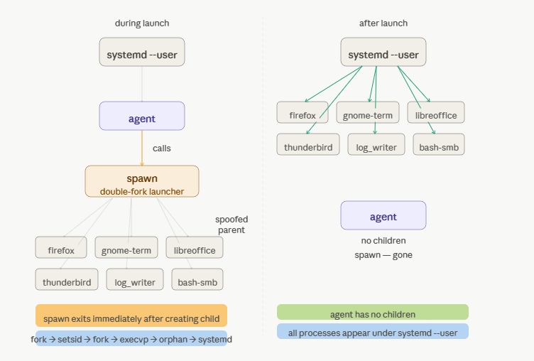
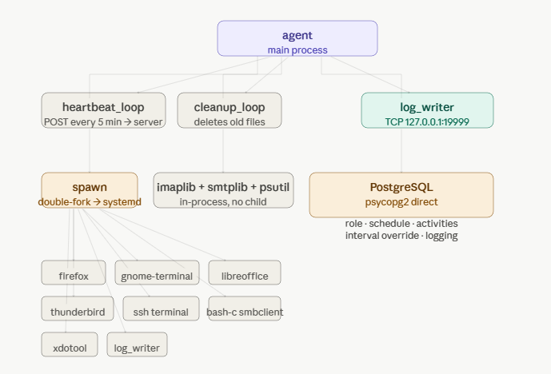

# LISA Linux Agent — Technical Documentation

## Table of Contents

1. [Overview](#1-overview)
2. [Architecture](#2-architecture)
3. [Technologies and Libraries](#3-technologies-and-libraries)
4. [Actions and Capabilities](#4-actions-and-capabilities)
   - [4.1 Web Browser](#41-web-browser)
   - [4.2 Terminal](#42-terminal)
   - [4.3 LibreOffice Automation](#43-libreoffice-automation)
   - [4.4 Email — Send and Read](#44-email--send-and-read)
   - [4.5 SMB Network Share Access](#45-smb-network-share-access)
   - [4.6 SSH Connect](#46-ssh-connect)
   - [4.7 Cron Management](#47-cron-management)
   - [4.8 VS Code](#48-vs-code)
   - [4.9 File Operations](#49-file-operations)
5. [Process Spoofing — spawn](#5-process-spoofing--spawn)
6. [Parent Process Hiding Strategy](#6-parent-process-hiding-strategy)
7. [Log Writer](#7-log-writer)
8. [Database Connection](#8-database-connection)
9. [Server Communication and Heartbeat](#9-server-communication-and-heartbeat)
10. [Role System and Activity Scheduling](#10-role-system-and-activity-scheduling)
11. [Work Hours, Breaks, and Holidays](#11-work-hours-breaks-and-holidays)
12. [Singleton and Lock File](#12-singleton-and-lock-file)
13. [File Cleanup](#13-file-cleanup)
14. [Known Limitations](#14-known-limitations)

---

## 1. Overview

The LISA Linux Agent is a Python-based user behaviour simulation agent compiled into a standalone Linux executable using PyInstaller. It runs on Ubuntu 22.04 desktop machines and simulates realistic user activity — browsing the web, sending emails, editing documents, accessing file shares, connecting via SSH, and more.

The agent connects directly to a PostgreSQL database on the LISA Server to receive its role configuration, log activities, and send periodic heartbeats. All activity is driven by configurable role profiles stored in YAML files or in the database via the LISA frontend.

---

## 2. Architecture

### Process Spoofing — spawn

The diagram below shows how spawn uses the double-fork technique to re-parent all launched processes to systemd, and what the process tree looks like before and after.



---

### Full Agent Architecture

The diagram below shows all components and how agent connects to them — threads, spawn, in-process libraries, database, and the SMB fix routing through spawn.



**Key design principle:** The agent never appears as the parent of any process it launches. All child processes are launched through `spawn` which uses double-fork to re-parent them to systemd.

---

## 3. Technologies and Libraries

| Technology | Purpose |
|---|---|
| Python 3.11 | Agent runtime language |
| PyInstaller | Compiles agent.py into a standalone binary |
| psycopg2-binary | Direct PostgreSQL connection for activity logging and role loading |
| requests | HTTP communication with the LISA Server API |
| python-dotenv | Loads configuration from the .env file |
| pyyaml | Reads YAML role definition files |
| psutil | In-process process inspection and termination — replaces all pkill/pgrep subprocess calls |
| imaplib | Headless IMAP email reading (built-in) |
| smtplib | Headless SMTP reply sending (built-in) |
| xdotool | Sends Ctrl+Return keystroke to Thunderbird compose window |
| smbclient | CLI tool for SMB share access |
| C (GCC) | spawn binary compiled from C source |
| systemd user service | Agent autostart on login |
| gnome-remote-desktop (grdctl) | Configures Linux machine as RDP target |

---

## 4. Actions and Capabilities

### 4.1 Web Browser

**File:** `actions/apps.py`

Opens a URL in the first available browser, tried in this order: `firefox`, `chromium-browser`, `chromium`, `google-chrome`, `xdg-open`. The agent picks randomly from a configured list of URLs, then calls `spawn_and_wait` to open the browser for a randomised duration (15–30 seconds) before killing it. The browser appears under systemd in the process tree, not the agent.

---

### 4.2 Terminal

**File:** `actions/terminal.py`

Runs bash commands in a visible terminal window. Opens a terminal emulator in order of availability: `gnome-terminal`, `xfce4-terminal`, `xterm`. The selected terminal opens with the command pre-loaded and a sleep to keep it open for 15–25 seconds, then is killed by PID. Parent appears as systemd via spawn.

---

### 4.3 LibreOffice Automation

**File:** `actions/office.py`

Launches LibreOffice Writer or Calc to create documents and spreadsheets. Both action names `libreoffice_writer` / `word_document` and `libreoffice_calc` / `excel_spreadsheet` map to the same underlying functions.

**LibreOffice Writer** — generates document content, writes it as `.txt`, then converts it to `.odt` via `spawn_detached(["libreoffice", "--headless", "--convert-to", "odt", ...])`. The agent polls for the output file to appear (up to 30 seconds) before proceeding. The `.odt` is then opened in LibreOffice Writer via `spawn_and_wait` for 20–40 seconds. Closed via `psutil` in-process — no child process spawned.

**LibreOffice Calc** — generates spreadsheet data, writes it as `.csv`, then converts it to `.ods` via `spawn_detached(["libreoffice", "--headless", "--convert-to", "ods", ...])`. Same polling approach as Writer. The `.ods` is then opened in LibreOffice Calc via `spawn_and_wait` for 20–40 seconds. Closed via `psutil` in-process — no child process spawned.

Both headless conversion steps run through spawn so the LibreOffice process appears under systemd, not the agent.

Files are saved to `~/Documents/` with a timestamp in the filename and cleaned up after 4 days by the cleanup thread.

Templates for document content and spreadsheet data are stored in `actions/templates/`.

---

### 4.4 Email — Send and Read

**File:** `actions/email.py`

Two distinct email mechanisms are used — one for sending (Thunderbird + xdotool) and one for reading and replying (headless imaplib/smtplib).

#### Sending (`send_email`)

Thunderbird is launched via `spawn_detached` with a pre-filled compose window using the `-compose` flag:

```python
["thunderbird", "-compose", "to=...,subject=...,body=...,attachment=..."]
```

Flow after launch:
1. Wait 10 seconds for the compose window and any attachment to fully load
2. Focus the compose window via `spawn_detached(["xdotool", "search", "--sync", "--onlyvisible", "--class", "Thunderbird", "windowfocus"])` — polls `/proc/{pid}` until xdotool exits. Uses `--class Thunderbird` (not `--name`) so it works regardless of system language
3. Wait 1 second
4. Trigger send via `spawn_detached(["xdotool", "key", "ctrl+Return"])` — polls until complete
5. Wait 5 seconds for SMTP transmission to begin
6. Kill the Thunderbird process

Both xdotool calls go through `spawn_detached` so they appear under systemd, not the agent. `_xdotool_available()` uses `shutil.which()` — no subprocess spawned.

The agent filters its own email address from the recipient list before picking a target — it never sends to itself.

Attachments are picked in sorted queue order from `dist/attachments/` and included 80% of the time. Supported: `.jpg`, `.jpeg`, `.png`, `.pdf`, `.docx`, `.doc`, `.odt`.

If `xdotool` is not installed, the compose window opens but the send is not triggered.

#### Reading (`read_email`)

Reading is done **headlessly** via `imaplib` — no Thunderbird window is opened. The agent:

1. Connects to the IMAP server on port 993 with SSL (`IMAP4_SSL`)
2. Searches for unread messages, processes newest first (up to 3)
3. Skips self-emails and bounce senders (`mailer-daemon`, `postmaster`, `noreply`, `no-reply`)
4. Marks each email as read
5. Simulates reading time (7–10 seconds per message)
6. Downloads and opens the first attachment if present
7. Sends a reply via `smtplib` on port 587 with STARTTLS

#### Thunderbird Browsing Session (`open_thunderbird`)

Opens Thunderbird as a full GUI window for a browsing session via `spawn_and_wait`, holding it open for 30–60 seconds. No email is sent or read — purely simulating the user opening their mail client.

#### Received Attachments

Downloaded to `~/Downloads/LISA_Attachments/`. Opened via spawn (systemd as parent):
- `.docx` / `.odt` → `libreoffice --writer` via `spawn_detached`
- `.pdf` → tries `atril`, `mupdf`, `okular`, `xreader`, `evince` via `open_pdf_via_spawn`
- `.jpg` / `.png` / `.bmp` → tries `eog`, `shotwell`, `gpicview`, `feh` via `open_image_via_spawn`

Each attachment is opened for 25 seconds then killed by PID or process name.

---

### 4.5 SMB Network Share Access

**File:** `actions/smb.py`

Accesses a Samba share using the `smbclient` CLI. The share is accessed as a guest (`-N`) by default, or with credentials if configured. Five operations are performed in sequence during a browse session:

1. List all files on the share
2. Read all text files (`.txt`, `.md`, `.csv`, `.log`) — downloads each, logs content up to 200 chars
3. Edit an existing text file — appends a timestamped note, resets the file if it exceeds 2KB
4. Create a new timestamped file then delete it
5. Copy an existing file with a new name then delete the copy

`smbclient` is called via `spawn_detached(["bash", "-c", "smbclient ... > tmpfile"])`. Output is written to a temp file; the agent polls `/proc/{pid}` until spawn exits, then reads the temp file for results. This ensures smbclient appears under systemd, not the agent.

Test the share from the agent:
```bash
smbclient //LISA_SERVER_IP/share -N -c "ls"
```

---

### 4.6 SSH Connect

**File:** `actions/ssh.py`

Opens a visible `gnome-terminal` window running an interactive SSH session via `sshpass`, then closes it after the configured duration. Uses `spawn_detached` so the terminal appears under systemd, not the agent.

The SSH command is built as:
```bash
sshpass -p {password} ssh -o StrictHostKeyChecking=no -o UserKnownHostsFile=/dev/null -o LogLevel=ERROR {username}@{host}
```

A `sleep {duration}` appended to the terminal command keeps the window visible for the full duration even if the SSH session exits early. After the duration, the terminal is killed by PID, then remaining SSH processes are cleaned up via `psutil` in-process — no child process spawned.

If no password is configured, `sshpass` is omitted and the connection is made with `ssh` directly.

Multiple SSH targets can be configured per role, each with its own host, username, and password.

---

### 4.7 Cron Management

**File:** `actions/cron.py`

Manages cron jobs using `crontab -l` and `crontab -`. All LISA-managed jobs are marked with a comment `# LISA:{name}` to identify them. Mirrors the Windows scheduled task manager logic with the same 3-phase execution:

**Phase 1 — delete/restore:** processes delete and restore operations first before any job creation.

**Phase 2 — add jobs:** adds jobs from the role config, skipping any that were previously deleted. If a job appears in both the jobs list and the deleted list, it is automatically restored.

**Phase 3 — enable/disable/run:** enables (uncomments), disables (comments with `#DISABLED#`), or immediately executes a job.

Deleted cron jobs are tracked in the `agent_deleted_crons` table in PostgreSQL to prevent recreation on the next cycle.

---

### 4.8 VS Code

**File:** `actions/apps.py`

Opens VS Code with a randomly generated Python code snippet, then runs it in a visible terminal.

Flow:
1. Generate a random Python snippet and write it to `~/Documents/lisa_snippet_{random}.py`
2. Open VS Code via `spawn_detached` — appears under systemd
3. Wait 30–60 seconds (simulate reviewing/editing)
4. Open `gnome-terminal` running `python3 {snippet}; sleep 10` via `spawn_detached`
5. Wait 15 seconds for code to execute
6. Kill VS Code via `psutil.process_iter()` — finds and terminates Code processes matching the snippet filename in-process, no child process spawned

The snippet file is retained after the session and cleaned up by the cleanup thread after 4 days.

---

### 4.9 File Operations

**File:** `actions/files.py`

Creates, edits, copies, and deletes text files in the agent's Documents folder:

- `create_file` — creates a file at the configured path with randomly generated content. Expands `{timestamp}` and `{date}` placeholders in content templates.
- `edit_file` — appends a timestamped note to an existing file. Resets the file if it exceeds 4KB.
- `copy_file` — copies a file with a timestamped suffix.
- `delete_file` — deletes a file at the configured path.

---

## 5. Process Spoofing — spawn

**Files:** `spawn.c`, `spawn` (compiled binary)

`spawn` is a small C binary that uses the **double-fork daemon pattern** to fully detach a child process from the agent:

1. Agent calls `spawn` with the target command and arguments
2. `spawn` creates a pipe and forks → **first child**
3. First child calls `setsid()` — starts a new session, detaches from agent's process group
4. First child forks again → **grandchild** (the actual target process)
5. First child sends the grandchild PID through the pipe, then calls `_exit(0)`
6. Grandchild redirects stdin/stdout/stderr to `/dev/null` and calls `execvp()` to become the target binary
7. `spawn` (parent) reads the grandchild PID from the pipe, prints it to stdout, reaps the first child with `waitpid`, then exits
8. `spawn_detached` in Python reads this PID from stdout and returns it for later use with `_kill_pid`

The grandchild is now an orphan — Linux re-parents orphaned processes to **systemd --user**. The target process appears under systemd in the process tree, not under the agent.

### Compile

```bash
gcc -o spawn spawn.c
```

---

## 6. Parent Process Hiding Strategy Verified by Auditd

| Process | Launched via | Appears under |
|---|---|---|
| firefox / chromium | spawn | systemd |
| gnome-terminal / xterm | spawn | systemd |
| code (VS Code) | spawn | systemd |
| libreoffice --writer | spawn | systemd |
| libreoffice --calc | spawn | systemd |
| thunderbird | spawn | systemd |
| gnome-terminal (SSH) | spawn | systemd |
| atril / mupdf (PDF) | spawn | systemd |
| eog / shotwell (images) | spawn | systemd |
| log_writer | spawn | systemd |
| imaplib / smtplib | in-process | — (no child) |
| xdotool (email send) | spawn | systemd |
| psutil (process kills) | in-process | — (no child) |
| smbclient | spawn | systemd |

> `smbclient` and LibreOffice headless conversion both run via spawn so they appear under systemd. All agent-launched processes are fully spoofed.

---

## 7. Log Writer

**Files:** `utils/log_writer.py`, `log_writer/` (compiled binary directory)

The log writer is a separate executable that acts as a TCP socket server listening on `localhost:19999`. It receives log records from the agent over a local TCP connection and writes them to `logs/agent.log`. This keeps the log file handle out of the agent process — it appears under systemd (launched via spawn) instead of the agent.

The agent uses `logging.handlers.SocketHandler("127.0.0.1", 19999)` to send all log messages as pickled `LogRecord` objects to log_writer, which deserialises them and writes to the log file.

**Singleton protection** uses a PID lock file at `/tmp/lisa_log_writer.lock`. On startup, log_writer checks if the stored PID has a corresponding `/proc/{pid}` entry — if the process is still running it exits, otherwise it overwrites the stale lock with its own PID. The lock file is removed on exit via `atexit`.

Before launching log_writer, the agent checks if it is already running using `psutil.process_iter()` — no `pgrep` subprocess is spawned.

> **Frozen path note:** When compiled with PyInstaller (`sys.frozen = True`), `sys.executable` points to `dist/agent` rather than the Python interpreter. The agent resolves the log_writer path using `Path(sys.executable).parent.parent` to navigate from `dist/` up to the linux-agent root where `log_writer/` lives. When running as a script, `Path(__file__).parent.parent` is used instead. **Frozen** refers to the PyInstaller-compiled state where all Python code is bundled into a single binary — `sys.frozen` is set to `True` by PyInstaller at compile time.

The log_writer is compiled with `--onedir` (not `--onefile`), producing a `log_writer/` directory containing the binary and its shared library dependencies:

```bash
pyinstaller --onedir --name log_writer --distpath . utils/log_writer.py
```

---

## 8. Database Connection

**File:** `client/database.py`

The agent connects directly to the LISA Server PostgreSQL database using psycopg2. All credentials are loaded from the `.env` file via python-dotenv.

The agent ID is generated once from the username and a random UUID suffix: `agent_{username}_{uuid4().hex[:12]}`. It is stored in `~/.lisa_agent_id` and reloaded on every startup — it survives reboots, MAC address changes, and hostname changes.

Key database operations:

- `ensure_agent_exists` — registers the agent on first run
- `get_agent_role` — retrieves the current role assignment
- `get_role_definition` — loads the full role activity config (for custom roles)
- `log_activity` — records each completed action with type, details, and timestamp
- `update_agent_status` — updates the agent's last-seen status
- `get_agent_schedule` — retrieves assigned work hours
- `get_agent_break` — retrieves assigned break times
- `is_public_holiday` — checks if today is a configured holiday
- `get_deleted_crons` / `mark_cron_deleted` / `restore_cron` — manages cron job deletion state
- `get_agent_interval` — retrieves the per-agent activity interval override (`interval_min`, `interval_max`) from the database, or `None` if not set
- `set_agent_interval` — sets the activity interval override for this agent in the database

---

## 9. Server Communication and Heartbeat

**File:** `client/server_api.py`

The agent sends an HTTP POST to `http://{SERVER_IP}:{SERVER_PORT}/api/agents/heartbeat` every 300 seconds. The heartbeat payload includes the agent ID, username, role, `os_type`, `system_info`, `last_activity`, and `current_activity`.

There is no separate activity logging endpoint — activities are logged through the heartbeat itself via the `current_activity` field. The backend reads this field and saves it to `agent.last_activity` and as an `AgentActivity` record.

The heartbeat thread also checks for role changes in the database. If the role has been updated in the frontend, the agent reloads its activity list without restarting. If the custom role definition itself was updated (via `updated_at`), the activities are reloaded even if the role name did not change.

---

## 10. Role System and Activity Scheduling

**Files:** `roles/`, `agent.py`

Roles define the set of activities the agent performs and their relative weights. Two role sources are supported:

**YAML roles** — stored in `roles/user.yaml`, `roles/admin.yaml`, `roles/dev.yaml`. Loaded from disk at startup.

**Custom roles** — created through the LISA frontend role builder and stored in the `agent_role_definitions` table in PostgreSQL. Loaded via `db.get_role_definition()`. The database role overrides the YAML role if one is assigned.

Activities are selected using weighted random choice — an activity with weight 3 is chosen three times as often as one with weight 1. Between activities, the agent waits a randomised interval. The default interval is configured via `activity_interval_min` and `activity_interval_max` in `config/settings.yaml`. This can be overridden per agent from the LISA frontend (Agent detail page → Activity Interval), which stores the values in the database and takes precedence over the local settings.

The priority chain for interval values is: **DB override → settings.yaml → hardcoded fallback (30s / 50s)**.

---

## 11. Work Hours, Breaks, and Holidays

**File:** `agent.py` — `is_work_time()` and `_check_break()`

The agent only performs activities during configured working hours. Three levels of scheduling are checked in order:

1. **Public holidays** — if today is a holiday in the `public_holidays` table, the agent is idle all day.
2. **Agent-specific schedule** — from the `agent_schedules` table, assigned via the frontend. Supports overnight shifts (when `work_start > work_end`).
3. **Local schedule** — fallback from `config/settings.yaml` (`work_start`, `work_end`, `work_days`).

Break times are checked within working hours. If the current time falls within an assigned break window, the agent is idle until the break ends. When outside working hours, the agent checks again every 5 minutes.

---

## 12. Singleton and Lock File

**File:** `agent.py` — `check_singleton()`

The agent creates a lock file (`{agent_id}.lock`) on startup to prevent multiple instances running simultaneously. If the lock file already exists, it is deleted and a new one is created — treating it as a stale lock from a previous session (e.g. after a reboot or crash). The lock file is deleted automatically on the next startup or on clean exit / SIGTERM.

---

## 13. File Cleanup

**File:** `actions/cleanup.py`

A background thread runs at startup and every 24 hours, deleting files older than 4 days:

- `~/Documents/lisa_doc_*.odt` and `lisa_doc_*.txt` — LibreOffice Writer documents
- `~/Documents/lisa_sheet_*.ods` and `lisa_sheet_*.csv` — LibreOffice Calc spreadsheets
- `/tmp/lisa_edit_*.py` — VS Code snippet files
- `~/Downloads/LISA_Attachments/*` — received email attachments

---

## 14. Known Limitations

| Limitation | Detail |
|---|---|
| X11 required | `xdotool` used for Thunderbird email sending only works on X11. Ubuntu 22.04 defaults to Wayland — `WaylandEnable=false` must be set in `/etc/gdm3/custom.conf`. |
| Thunderbird must be pre-configured | Thunderbird must be installed and have the agent's email account configured before `send_email` and `read_email` actions will work. |
| Graphical session required | The agent runs as a user service and requires an active graphical session. Auto-login must be enabled in `/etc/gdm3/custom.conf` for unattended operation after reboot. |
| Ubuntu 22.04 dependency | `grdctl` and `gnome-remote-desktop` with RDP support are stable on Ubuntu 22.04+. The Linux-as-RDP-target setup will not work on older Ubuntu versions. |
